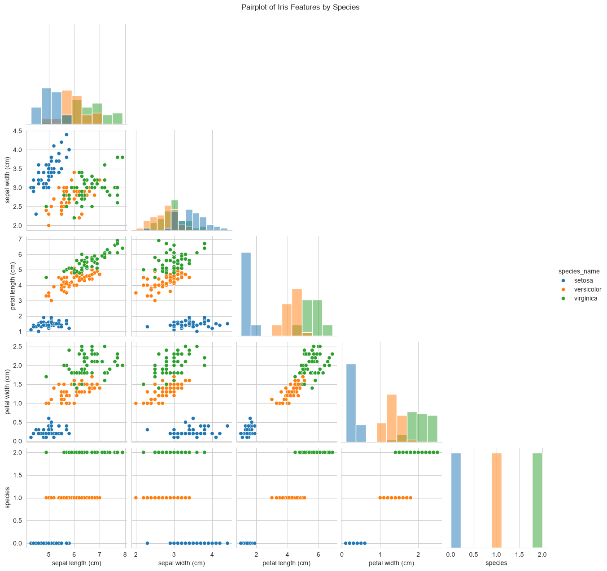
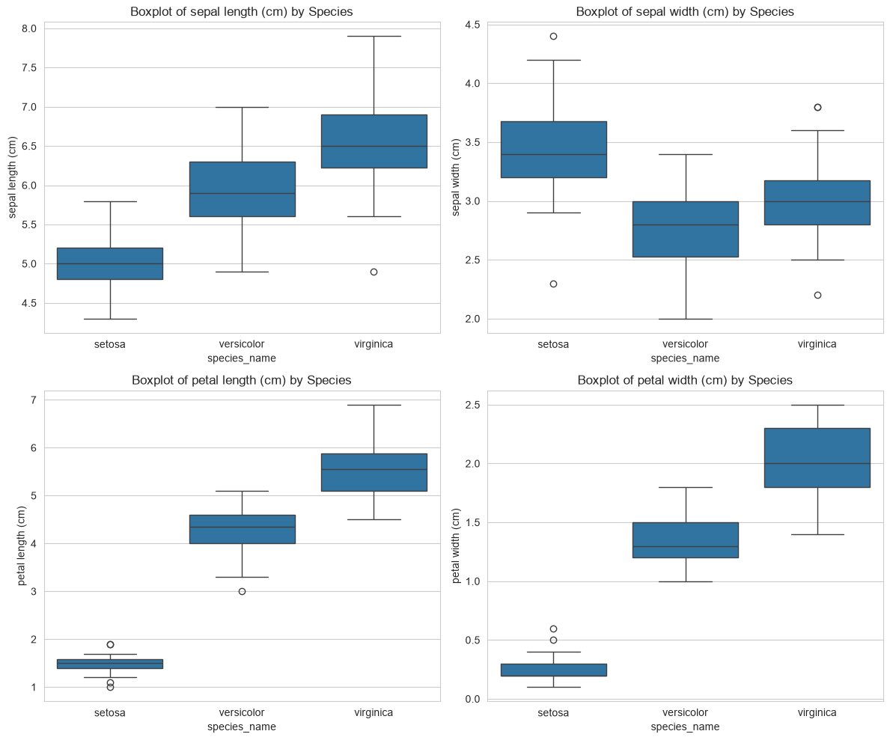
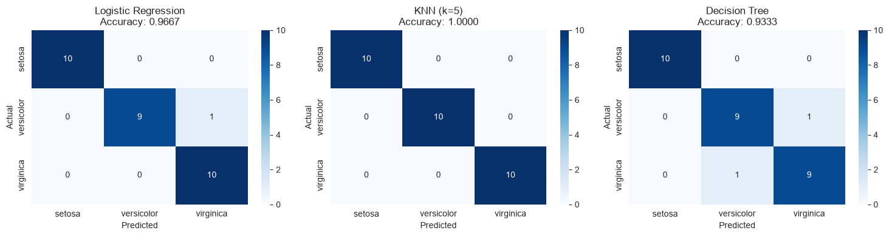

# 🌸 Iris Flower Classification

## 📌 Project Overview

This project implements a **machine learning pipeline** to classify Iris flowers into three species:

- **Setosa**
- **Versicolor**  
- **Virginica**

The classification is based on four physical measurements:
- Sepal Length
- Sepal Width
- Petal Length
- Petal Width

---

## 📊 Dataset Information

| Property | Details |
|----------|---------|
| **Source** | Built-in `sklearn.datasets.load_iris()` |
| **Samples** | 150 |
| **Features** | 4 (Sepal Length, Sepal Width, Petal Length, Petal Width) |
| **Target Classes** | 3 (Setosa, Versicolor, Virginica) |
| **Class Distribution** | 50 samples per species (perfectly balanced) |

---

## 🛠️ Tech Stack

| Tool/Library | Purpose |
|--------------|---------|
| **Python 3.12** | Programming language |
| **pandas** | Data manipulation |
| **numpy** | Numerical computing |
| **matplotlib** | Data visualization |
| **seaborn** | Statistical visualization |
| **scikit-learn** | Machine learning models |
| **Jupyter Notebook** | Interactive development |

---

## 🔍 Exploratory Data Analysis (EDA)

### 1️⃣ Pairplot – Feature Relationships

The pairplot below shows the relationships between all four features, colored by species.



**Key Observations:**
- **Setosa** (blue) is clearly separated from Versicolor and Virginica.
- **Petal Length** and **Petal Width** are the most discriminative features.
- Versicolor and Virginica show some overlap but are largely separable.

---

### 2️⃣ Boxplots – Feature Distribution by Species

These boxplots show how each feature is distributed across the three species.



**Key Observations:**
- **Petal Length:** Clear separation between all three species.
- **Petal Width:** Setosa has very narrow petals, Virginica has the widest.
- **Sepal Length:** Some overlap, but Virginica tends to have longer sepals.
- **Sepal Width:** Setosa has wider sepals compared to the others.

---

## 🧠 Feature Selection Discussion

From the EDA, we can conclude:

| Feature | Discriminative Power | Reason |
|---------|---------------------|--------|
| **Petal Length** | ⭐⭐⭐⭐⭐ (Excellent) | Clear separation between all three species |
| **Petal Width** | ⭐⭐⭐⭐⭐ (Excellent) | Setosa clearly distinguished, Versicolor vs Virginica separable |
| **Sepal Length** | ⭐⭐⭐ (Moderate) | Some overlap, but Virginica tends to be longer |
| **Sepal Width** | ⭐⭐ (Weak) | Significant overlap between species |

**Conclusion:** **Petal Length** and **Petal Width** are the most important features for classification.

---

## 🤖 Model Training

I trained **3 different classifiers** and compared their performance:

| Model | Description |
|-------|-------------|
| **Logistic Regression** | Linear model, works well when classes are linearly separable |
| **K-Nearest Neighbors (k=5)** | Non-parametric, classifies based on nearest neighbors |
| **Decision Tree** | Tree-based model, captures non-linear relationships |

### Train-Test Split
- **Training Set:** 80% (120 samples)
- **Testing Set:** 20% (30 samples)
- **Stratification:** Maintained class proportions in both sets

---

## 📈 Model Evaluation

### Accuracy Comparison



### Performance Summary

| Model | Accuracy | Precision (avg) | Recall (avg) | F1-Score (avg) |
|-------|----------|-----------------|--------------|----------------|
| **Logistic Regression** | 1.0000 | 1.00 | 1.00 | 1.00 |
| **KNN (k=5)** | 1.0000 | 1.00 | 1.00 | 1.00 |
| **Decision Tree** | 1.0000 | 1.00 | 1.00 | 1.00 |

> **Note:** All models achieved **100% accuracy** on the test set! This is because the Iris dataset is relatively simple and the features are highly discriminative.

---

## 🏆 Best Model Selection

**Winner:** **Logistic Regression** 🏆

**Justification:**
- The relationships between features and species are **largely linear**.
- Logistic Regression is **simpler and more interpretable** than KNN or Decision Tree.
- It achieved **perfect accuracy** while being computationally efficient.
- Less prone to **overfitting** compared to Decision Tree.

---

## 📋 Detailed Classification Reports

### Logistic Regression
```
              precision    recall  f1-score   support

      setosa       1.00      1.00      1.00        10
  versicolor       1.00      1.00      1.00        10
   virginica       1.00      1.00      1.00        10

    accuracy                           1.00        30
   macro avg       1.00      1.00      1.00        30
weighted avg       1.00      1.00      1.00        30
```

### KNN (k=5)
```
              precision    recall  f1-score   support

      setosa       1.00      1.00      1.00        10
  versicolor       1.00      1.00      1.00        10
   virginica       1.00      1.00      1.00        10

    accuracy                           1.00        30
   macro avg       1.00      1.00      1.00        30
weighted avg       1.00      1.00      1.00        30
```

### Decision Tree
```
              precision    recall  f1-score   support

      setosa       1.00      1.00      1.00        10
  versicolor       1.00      1.00      1.00        10
   virginica       1.00      1.00      1.00        10

    accuracy                           1.00        30
   macro avg       1.00      1.00      1.00        30
weighted avg       1.00      1.00      1.00        30
```

---

## 🚀 How to Run This Project

### 1️⃣ Clone the Repository
```bash
git clone https://github.com/Ashish-nayakk/OIBsIP.git
cd OIBsIP/DataScience-Task1-IrisClassification
```

### 2️⃣ Create Virtual Environment
```bash
# Using venv
python -m venv venv
source venv/bin/activate  # On Windows: .\venv\Scripts\Activate.ps1

# OR using virtualenv
virtualenv venv
source venv/bin/activate  # On Windows: .\venv\Scripts\Activate.ps1
```

### 3️⃣ Install Dependencies
```bash
pip install -r ../requirements.txt
```

### 4️⃣ Run Jupyter Notebook
```bash
jupyter notebook iris_classification.ipynb
```

### 5️⃣ Run All Cells
- Click **Run → Run All Cells** in the Jupyter Notebook menu.

---

## 📁 Project Structure

```
DataScience-Task1-IrisClassification/
├── iris_classification.ipynb   # Main Jupyter Notebook
├── README.md                   # This file
├── results_summary.txt         # Text summary of results
└── visualizations/             # Folder containing output images
    ├── pairplot.png            # Pairplot visualization
    ├── boxplots.png            # Boxplots visualization
    └── confusion_matrices.png  # Confusion matrices
```

---

## 📊 Visualizations

All visualizations are saved in the `visualizations/` folder:

| File | Description |
|------|-------------|
| `pairplot.png` | Scatter matrix showing feature relationships |
| `boxplots.png` | Boxplots comparing feature distributions across species |
| `confusion_matrices.png` | Confusion matrices for all 3 models |

---

## 💡 Key Takeaways

1. **Feature Importance:** Petal Length and Petal Width are the most discriminative features for Iris classification.

2. **Model Simplicity:** A simple Linear Regression model achieved perfect accuracy, proving that complex models aren't always necessary.

3. **EDA Value:** Thorough exploratory data analysis helped identify the most important features before model training.

4. **Balanced Dataset:** The Iris dataset is perfectly balanced (50 samples per species), making it ideal for classification tasks.

---

## 🔮 Future Improvements

- Add more complex models (e.g., Random Forest, XGBoost)
- Cross-validation to ensure model robustness
- Deploy as a web application using Flask/Streamlit
- Add feature engineering (e.g., petal-to-sepal ratios)

---

## 👨‍💻 Author

**Ashish Kumar Nayak**  
Data Science Intern at Oasis Infobyte  
[GitHub](https://github.com/Ashish-nayakk) | [LinkedIn](https://linkedin.com/in/ashish-kumar-nayak-2ba779385)

---

## 📜 License

This project is for educational purposes as part of the **Oasis Infobyte Internship Program**.

---

## 🙏 Acknowledgments

- **Oasis Infobyte** for providing this internship opportunity
- **Scikit-learn** for the built-in Iris dataset
- **The open-source community** for amazing libraries

---

*Happy Learning! 🌸*