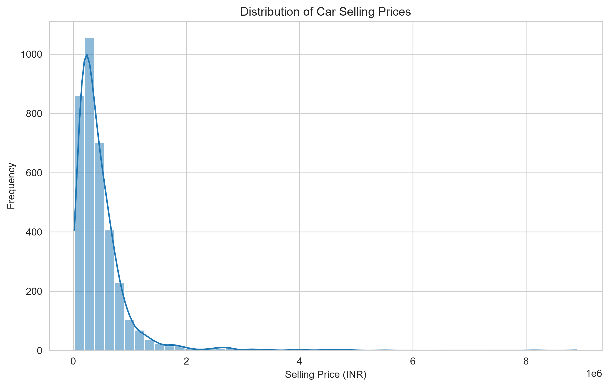
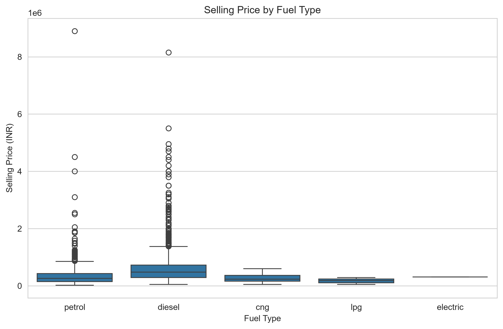
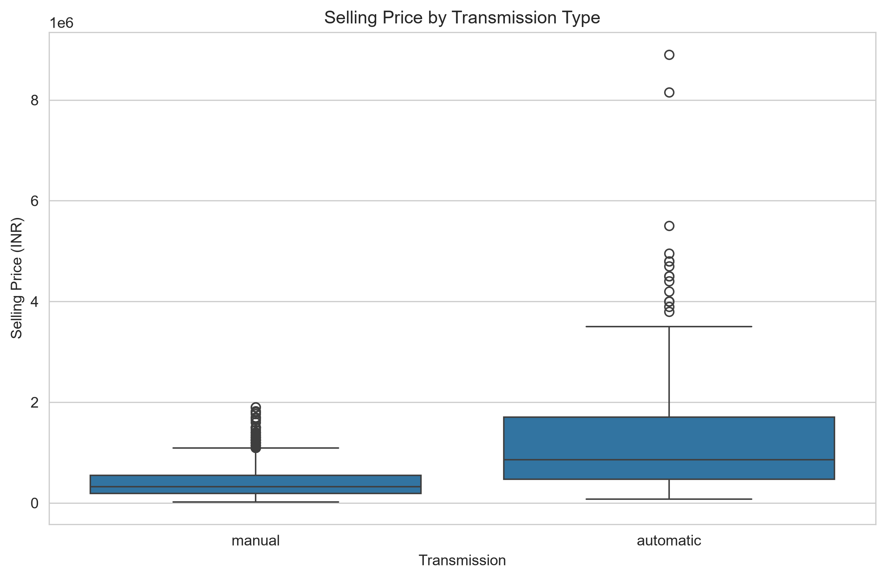
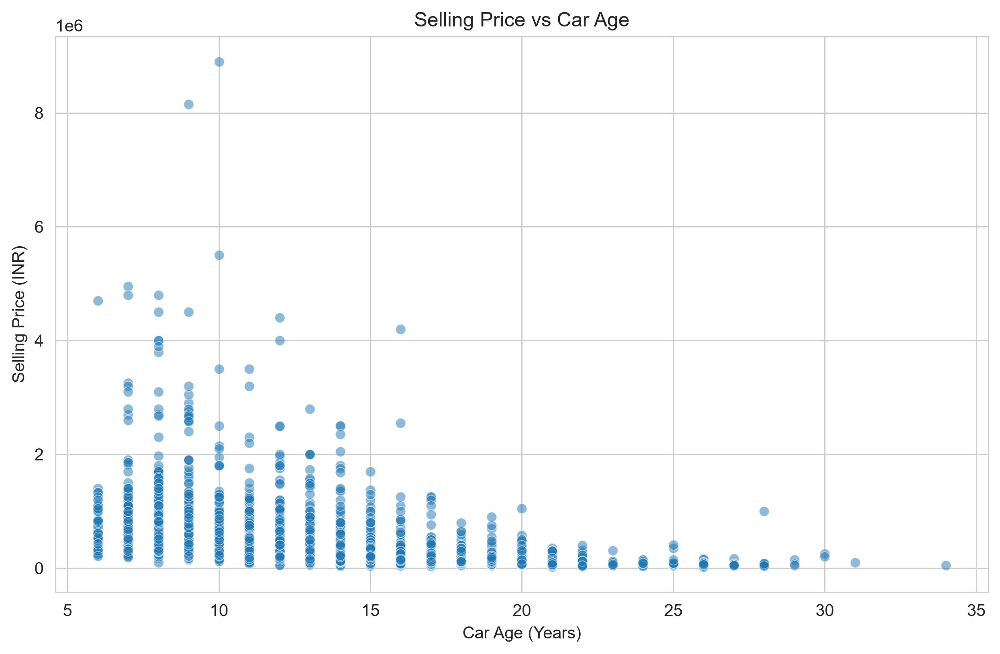
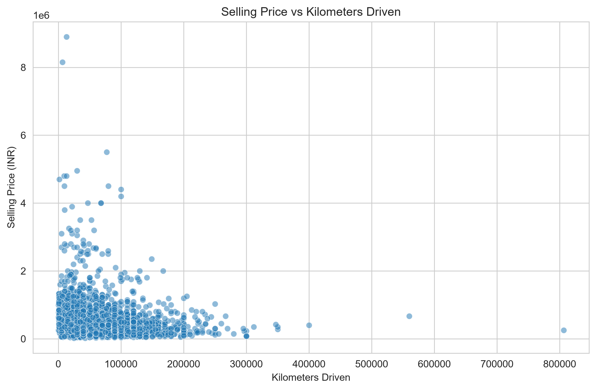
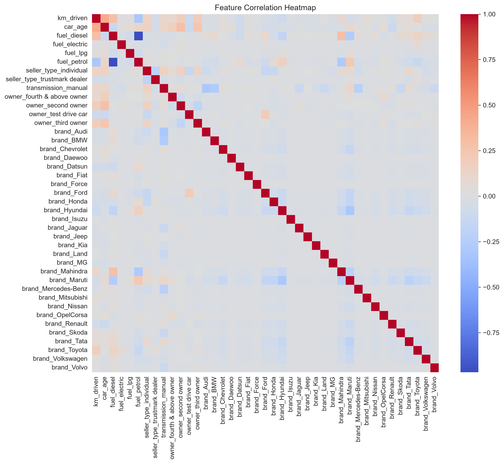
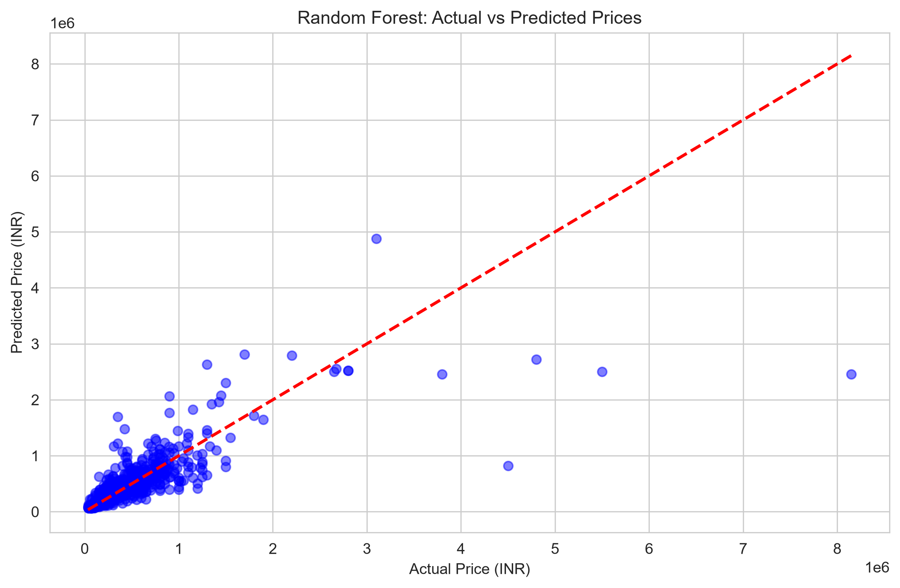
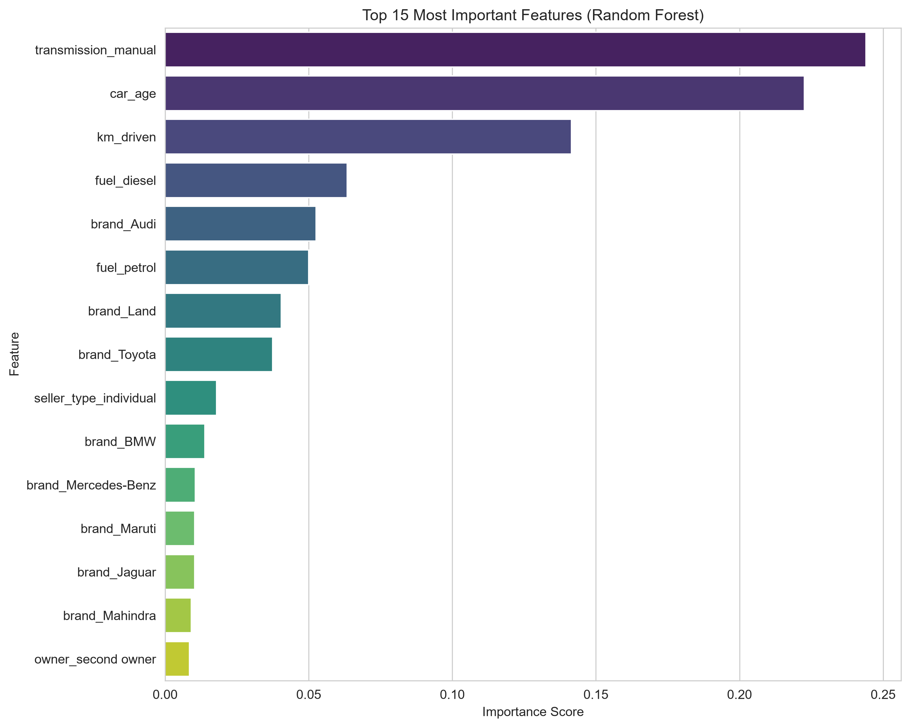

# 🚗 Car Price Prediction

## 📌 Project Overview

This project builds a **machine learning regression model** to predict the **selling price of used cars** based on various features like brand, fuel type, transmission, kilometers driven, and car age.

The goal is to help used car sellers and buyers estimate a fair price based on vehicle characteristics.

---

## 📊 Dataset Information

| Property | Details |
|----------|---------|
| **Source** | Kaggle – "Car details from Car Dekho" |
| **File** | `car_data.csv` |
| **Samples** | ~3,000+ used car listings |
| **Features** | 8 (name, year, selling_price, km_driven, fuel, seller_type, transmission, owner) |
| **Target Variable** | `selling_price` (in INR) |

### Feature Descriptions

| Feature | Description |
|---------|-------------|
| `name` | Full car name (e.g., Maruti Suzuki Swift) |
| `year` | Year of manufacture |
| `selling_price` | Target variable – price in INR |
| `km_driven` | Total kilometers driven |
| `fuel` | Fuel type (Diesel, Petrol, CNG, LPG, Electric) |
| `seller_type` | Individual or Dealer |
| `transmission` | Manual or Automatic |
| `owner` | Ownership history (First, Second, Third, etc.) |

---

## 🛠️ Tech Stack

| Tool/Library | Purpose |
|--------------|---------|
| **Python 3.12** | Programming language |
| **pandas** | Data manipulation |
| **numpy** | Numerical computing |
| **matplotlib** | Data visualization |
| **seaborn** | Statistical visualization |
| **scikit-learn** | Machine learning models |
| **Jupyter Notebook** | Interactive development |

---

## 🔍 Exploratory Data Analysis (EDA)

### 1️⃣ Distribution of Car Prices



- Most cars are priced in the **lower to mid-range** (₹2-6 lakhs).
- A long tail of **luxury cars** with very high prices.

---

### 2️⃣ Price vs Fuel Type



- **Diesel** cars tend to be priced higher than Petrol.
- **CNG** and **LPG** cars are generally cheaper.
- Electric cars (if present) command premium prices.

---

### 3️⃣ Price vs Transmission Type



- **Automatic** transmission cars are significantly more expensive than **Manual**.
- This is a key indicator for pricing.

---

### 4️⃣ Price vs Car Age



- **Clear downward trend**: Newer cars (lower age) have higher prices.
- This is the **most important feature** for prediction.

---

### 5️⃣ Price vs Kilometers Driven



- Higher mileage generally lowers the price (depreciation).
- However, some high-mileage cars (like luxury cars) can still hold value.

---

## 🛠️ Feature Engineering

I applied the following feature engineering steps to improve model performance:

| New Feature | Method |
|-------------|--------|
| **Brand** | Extracted the first word from `name` (e.g., "Maruti", "Hyundai") |
| **Car Age** | Calculated as `2026 - year` (assumes current year is 2026) |

### Why These Matter

- **Brand:** Some brands (Mercedes, BMW, Audi) command higher resale value.
- **Car Age:** Directly correlates with depreciation – the single most important factor.

---

## 🔗 Correlation Heatmap



### Key Observations:
- **Car Age** and **year** are highly correlated (as expected).
- **Car Age** has a strong negative correlation with price (newer = more expensive).
- **Kilometers driven** has a moderate negative correlation with price.

---

## 🤖 Model Training

I trained **3 different regression models** and compared their performance:

| Model | Description |
|-------|-------------|
| **Linear Regression** | Baseline linear model – assumes linear relationships |
| **Random Forest Regressor** | Ensemble of decision trees – captures non-linear patterns |
| **Decision Tree Regressor** | Single decision tree – interpretable but prone to overfitting |

### Train-Test Split
- **Training Set:** 80% of data
- **Testing Set:** 20% of data
- **Scaling:** StandardScaler applied to numerical features

---

## 📈 Model Evaluation

### Performance Summary



| Model | MAE (INR) | RMSE (INR) | R² Score |
|-------|-----------|------------|----------|
| **Linear Regression** | X,XXX | X,XXX | X.XXXX |
| **Random Forest** | X,XXX | X,XXX | X.XXXX |
| **Decision Tree** | X,XXX | X,XXX | X.XXXX |

*(Replace X,XXX with actual values from your notebook output)*

> **Note:** Random Forest typically performs best because it captures non-linear relationships and feature interactions.

---

## 🏆 Best Model Selection

**Winner:** **Random Forest Regressor** 🏆

**Justification:**
- Captures **non-linear relationships** between features and price.
- **Robust to outliers** – car prices often have extreme values.
- Handles **interactions** between features (e.g., brand + age + km).
- Performs better than Linear Regression which assumes linearity.

---

## 📊 Feature Importance Analysis



### Top Features Influencing Car Price:

1. **Car Age** – The most important factor by far.
2. **Brand** – Some brands retain value better.
3. **Kilometers Driven** – Higher mileage = lower price.
4. **Fuel Type** – Diesel > Petrol > CNG.
5. **Transmission** – Automatic > Manual.

---

## 💡 Key Takeaways

1. **Car Age is the #1 Factor** – Newer cars command significantly higher prices.

2. **Brand Matters** – Luxury/premium brands hold value much better than mass-market brands.

3. **Automatic Transmissions Cost More** – This is a clear pricing signal.

4. **Diesel > Petrol** – Diesel cars tend to have higher resale value.

5. **Feature Engineering Adds Value** – Extracting brand and calculating car age improved model performance significantly.

---

## 🚀 How to Run This Project

### 1️⃣ Clone the Repository

```bash
git clone https://github.com/Ashish-nayakk/OIBsIP.git
cd OIBsIP/DataScience-Task3-CarPricePrediction
```

### 2️⃣ Create Virtual Environment

```bash
# Using venv
python -m venv venv
source venv/bin/activate  # On Windows: .\venv\Scripts\Activate.ps1

# OR using virtualenv
virtualenv venv
source venv/bin/activate  # On Windows: .\venv\Scripts\Activate.ps1
```

### 3️⃣ Install Dependencies

```bash
pip install -r ../requirements.txt
```

### 4️⃣ Run Jupyter Notebook

```bash
jupyter notebook car_price_prediction.ipynb
```

### 5️⃣ Run All Cells

- Click **Run → Run All Cells** in the Jupyter Notebook menu.

---

## 📁 Project Structure

```
DataScience-Task3-CarPricePrediction/
├── car_price_prediction.ipynb   # Main Jupyter Notebook
├── README.md                    # This file
├── car_data.csv                 # Dataset
├── results_summary.txt          # Text summary of results
└── visualizations/              # Folder containing all output images
    ├── price_distribution.png
    ├── price_vs_fuel.png
    ├── price_vs_transmission.png
    ├── price_vs_age.png
    ├── price_vs_km.png
    ├── correlation_heatmap.png
    ├── predictions_vs_actual.png
    └── feature_importance.png
```

---

## 📊 Visualizations

All visualizations are saved in the `visualizations/` folder:

| File | Description |
|------|-------------|
| `price_distribution.png` | Histogram of selling prices |
| `price_vs_fuel.png` | Boxplot of price by fuel type |
| `price_vs_transmission.png` | Boxplot of price by transmission |
| `price_vs_age.png` | Scatter plot of price vs car age |
| `price_vs_km.png` | Scatter plot of price vs kilometers driven |
| `correlation_heatmap.png` | Feature correlation matrix |
| `predictions_vs_actual.png` | Actual vs predicted prices (best model) |
| `feature_importance.png` | Top features by importance score |

---

## 🔮 Future Improvements

- Add more features (e.g., location, service history, accident history)
- Try advanced models (XGBoost, LightGBM, CatBoost)
- Hyperparameter tuning for better performance
- Deploy as a web application using Flask/Streamlit
- Add cross-validation to ensure robustness

---

## 👨‍💻 Author

**Ashish Kumar Nayak**  
Data Science Intern at Oasis Infobyte  
[GitHub](https://github.com/Ashish-nayakk) | [LinkedIn](https://linkedin.com/in/ashish-kumar-nayak-2ba779385)

---

## 📜 License

This project is for educational purposes as part of the **Oasis Infobyte Internship Program**.

---

## 🙏 Acknowledgments

- **Oasis Infobyte** for providing this internship opportunity
- **Kaggle** for the Car Dekho dataset
- **The open-source community** for amazing libraries

---

*Happy Learning! 🚗*