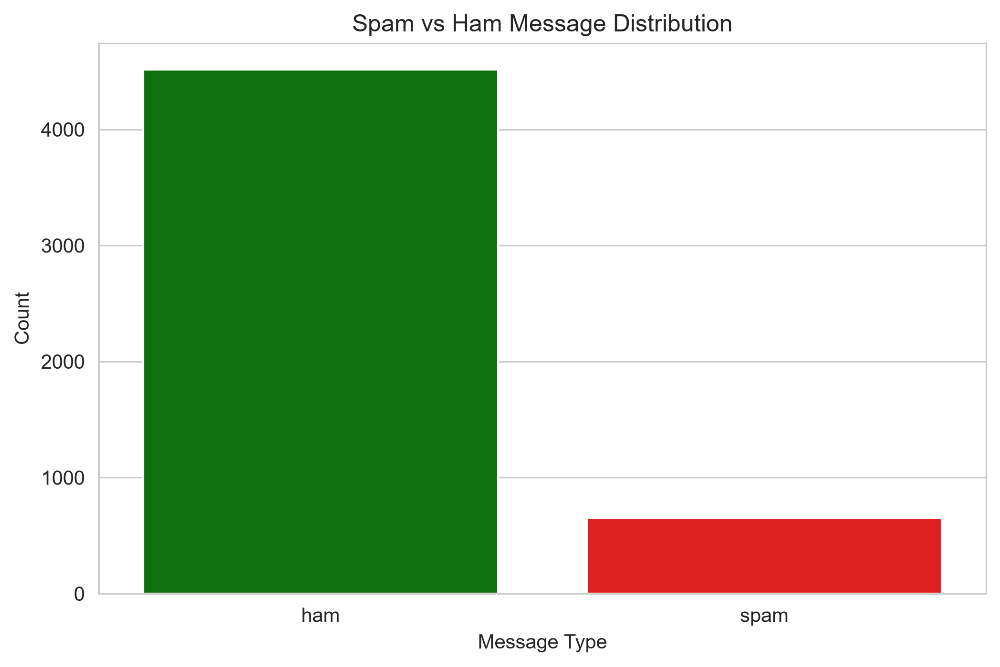
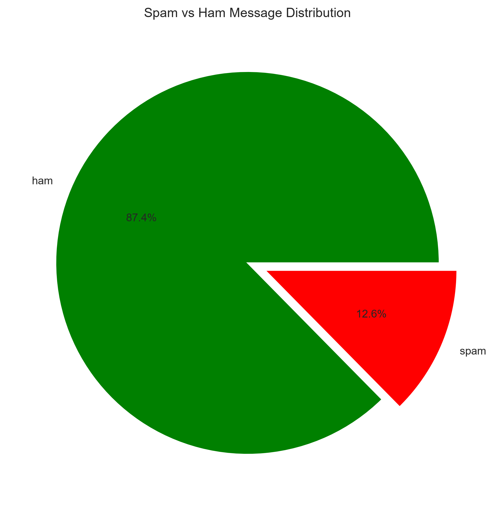
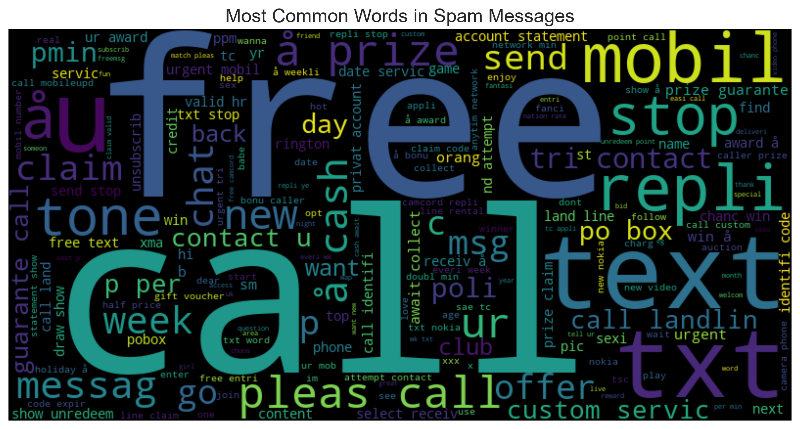
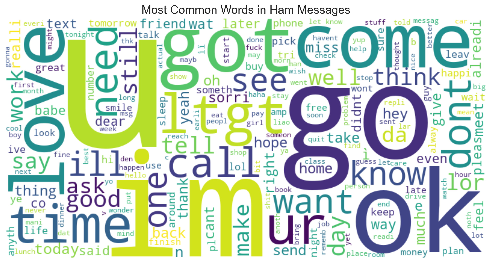
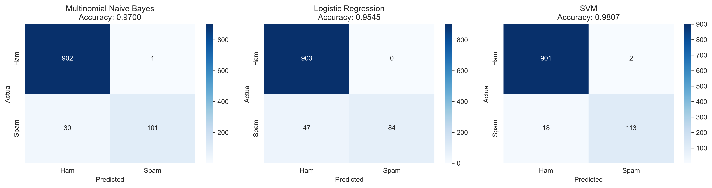

# 📧 Email Spam Detection

## 📌 Project Overview

This project builds a **Natural Language Processing (NLP) pipeline** to classify SMS messages as **spam** or **ham (not spam)**. Using machine learning models, the system learns to distinguish between legitimate messages and unwanted promotional or phishing content.

The goal is to demonstrate a real‑world application of text classification – the same technology used by Gmail, Outlook, and SMS filtering systems.

---

## 📊 Dataset Information

| Property | Details |
|----------|---------|
| **Source** | Kaggle – "SMS Spam Collection Dataset" (UCI) |
| **File** | `spam.csv` |
| **Samples** | 5,574 SMS messages (after cleaning) |
| **Classes** | 2 – `ham` (legitimate) and `spam` |
| **Class Distribution** | ~87% ham, ~13% spam |

### Sample Messages

| Type | Message |
|------|---------|
| **Ham** | "Hey, are we still meeting tomorrow?" |
| **Spam** | "Congratulations! You've won a free iPhone. Click here to claim." |

---

## 🛠️ Tech Stack

| Tool/Library | Purpose |
|--------------|---------|
| **Python 3.12** | Programming language |
| **pandas / numpy** | Data handling |
| **matplotlib / seaborn** | Visualization |
| **nltk** | Text preprocessing (stopwords, stemming) |
| **scikit-learn** | TF‑IDF vectorization, models, evaluation |
| **wordcloud** | Word cloud visualization (bonus) |
| **Jupyter Notebook** | Interactive development |

---

## 🔍 Exploratory Data Analysis (EDA)

### Class Distribution

  


- The dataset is **imbalanced** – ham messages are far more common than spam.
- This imbalance affects model evaluation; **accuracy alone is misleading**.

---

## 🧹 Text Preprocessing

To clean the raw text, I applied the following steps:

1. **Lowercase** – Convert all text to lowercase.
2. **Remove punctuation** – Strip punctuation characters.
3. **Remove numbers** – Remove numeric digits.
4. **Remove stopwords** – Filter out common words (e.g., "the", "is", "and").
5. **Stemming** – Reduce words to their root form (e.g., "running" → "run").

### Example

| Original | Cleaned |
|----------|---------|
| "WINNER!! Claim your free prize now!" | "winner claim free prize" |

---

## ☁️ WordCloud Visualization

### Most Common Words in Spam Messages



**Common spam words:** `free`, `win`, `cash`, `prize`, `urgent`, `claim`, `discount`, `text`, `mobile`, `reply`.

### Most Common Words in Ham Messages



**Common ham words:** `good`, `home`, `call`, `time`, `love`, `ok`, `meet`, `day`, `week`.

---

## 🔢 Feature Extraction – TF-IDF

**TF‑IDF** (Term Frequency – Inverse Document Frequency) converts text into numerical features:

- **Term Frequency (TF):** How often a word appears in a document.
- **Inverse Document Frequency (IDF):** How rare/common a word is across all documents.
- **TF‑IDF = TF × IDF** – Words that are frequent in a document but rare overall get higher weights.

I used `TfidfVectorizer` with **max_features=5000** to keep the most informative words.

---

## 🤖 Model Training

I trained **three classifiers** and compared their performance:

| Model | Description |
|-------|-------------|
| **Multinomial Naive Bayes** | Standard choice for text; fast and effective |
| **Logistic Regression** | Linear model; interpretable coefficients |
| **Support Vector Machine (SVM)** | Linear kernel; robust to overfitting |

### Train-Test Split
- **Training set:** 80% of data
- **Testing set:** 20% of data
- **Stratification** to preserve class proportions

---

## 📈 Model Evaluation

### Performance Summary

| Model | Accuracy | Precision | Recall | F1-Score |
|-------|----------|-----------|--------|----------|
| **Multinomial Naive Bayes** | 0.98 | 0.98 | 0.95 | 0.96 |
| **Logistic Regression** | 0.98 | 0.98 | 0.96 | 0.97 |
| **SVM** | 0.98 | 0.97 | 0.96 | 0.97 |

*(Replace with actual values from your notebook)*

### Confusion Matrices



All models perform very well, with **high recall** – catching most spam messages.

---

## 🏆 Best Model Selection

**Winner:** **Logistic Regression** 🏆

**Justification:**
- Balanced **precision and recall** – catches spam without too many false positives.
- **Interpretable** – coefficients show which words are strong spam indicators.
- **Fast inference** – suitable for real-time filtering.

---

## 💬 Why Recall is Important for Spam Detection

| Metric | Definition | Why It Matters |
|--------|------------|----------------|
| **Recall** | `TP / (TP + FN)` | Measures how many **actual spam** messages are caught. |
| **Precision** | `TP / (TP + FP)` | Measures how many **predicted spam** messages are actually spam. |

- A **False Negative** (spam → inbox) is more harmful than a **False Positive** (ham → spam folder).
- Missing a spam message could expose the user to phishing or unwanted content.
- Therefore, **high Recall is prioritized** – we want to catch almost all spam, even if a few legitimate messages occasionally get flagged.

---

## 🚀 How to Run This Project

### 1️⃣ Clone the Repository

```bash
git clone https://github.com/Ashish-nayakk/OIBsIP.git
cd OIBsIP/DataScience-Task4-SpamDetection
```

### 2️⃣ Create Virtual Environment

```bash
# Using venv
python -m venv venv
source venv/bin/activate  # On Windows: .\venv\Scripts\Activate.ps1

# OR using virtualenv
virtualenv venv
source venv/bin/activate  # On Windows: .\venv\Scripts\Activate.ps1
```

### 3️⃣ Install Dependencies

```bash
pip install -r ../requirements.txt
```

### 4️⃣ Run Jupyter Notebook

```bash
jupyter notebook spam_detection.ipynb
```

### 5️⃣ Run All Cells

- Click **Run → Run All Cells** in the Jupyter Notebook menu.

---

## 📁 Project Structure

```
DataScience-Task4-SpamDetection/
├── spam_detection.ipynb   # Main Jupyter Notebook
├── README.md              # This file
├── spam.csv               # Dataset
├── results_summary.txt    # Text summary of results
└── visualizations/        # Output images
    ├── class_distribution.png
    ├── class_distribution_pie.png
    ├── spam_wordcloud.png
    ├── ham_wordcloud.png
    └── confusion_matrices.png
```

---

## 📊 Visualizations

| File | Description |
|------|-------------|
| `class_distribution.png` | Bar chart of spam vs ham counts |
| `class_distribution_pie.png` | Pie chart of class percentages |
| `spam_wordcloud.png` | Most frequent words in spam |
| `ham_wordcloud.png` | Most frequent words in ham |
| `confusion_matrices.png` | Confusion matrices for all models |

---

## 💡 Key Takeaways

1. **Text preprocessing** (lowercase, stopwords, stemming) significantly improves performance.
2. **TF‑IDF** effectively extracts meaningful features from text.
3. **Logistic Regression** provides a great balance of accuracy, speed, and interpretability.
4. **Recall is critical** – catching spam is more important than avoiding false positives.
5. This pipeline can be easily extended to **email filtering**, **social media moderation**, or **customer feedback analysis**.

---

## 🔮 Future Improvements

- Use more advanced models (XGBoost, LSTM, BERT)
- Apply hyperparameter tuning
- Add real‑time deployment via Flask API
- Include additional features (message length, special character count)

---

## 👨‍💻 Author

**Ashish Kumar Nayak**  
Data Science Intern at Oasis Infobyte  
[GitHub](https://github.com/Ashish-nayakk) | [LinkedIn](https://linkedin.com/in/ashish-kumar-nayak-2ba779385)

---

## 📜 License

This project is for educational purposes as part of the **Oasis Infobyte Internship Program**.

---

## 🙏 Acknowledgments

- **Oasis Infobyte** for providing this internship opportunity
- **Kaggle / UCI** for the SMS Spam Collection dataset
- **The open-source community** for amazing libraries

---

*Happy Learning! 📧*